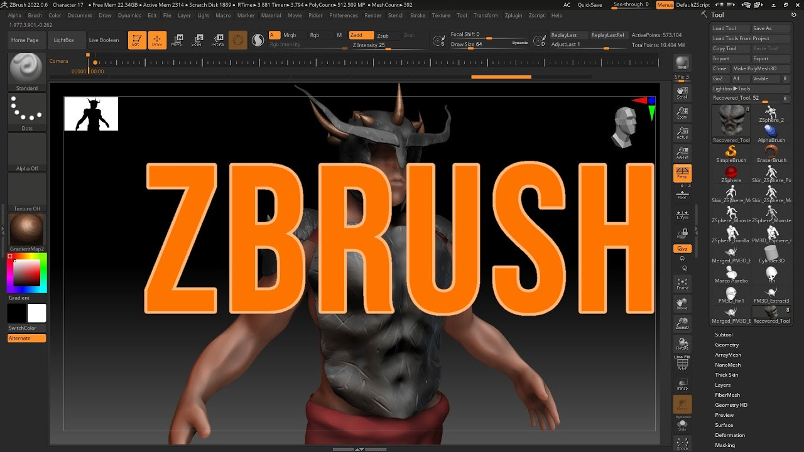

# ZBrush 2026 – Professional Digital Sculpting and 3D Modeling Software for Windows

ZBrush 2026 for Windows – a complete digital sculpting and 3D modeling suite for character design, organic modeling, detailing, texturing, and concept art. Explore powerful sculpting tools, customizable brushes, advanced detailing workflows, painting, rendering, and professional 3D creation features.

  
  
  
  

  

`Platform` `Windows` `License` `Version 2026` `ZBrush` `3D` `Digital Sculpting`

---

## ✨ Version 2026

ZBrush 2026 continues to expand its digital sculpting and 3D creation workflow. The 2026 series introduces improvements to ZModeler, Python scripting, brush organization, retopology, and asset management. The latest 2026.2.1 release also adds native Windows on Arm support, Substance Bridge integration, and updated GoZ workflows for Maya 2026 and 3ds Max 2026. Hhelp.maxon.net+1

---

## 🔑 Key Features

- **Digital sculpting** – shape highly detailed 3D models using a powerful brush-based workflow
- **Dynamic brushes** – customize brushes for sculpting, detailing, masking, and surface creation
- **Character design** – create detailed characters, creatures, faces, and anatomy
- **Hard-surface modeling** – build mechanical objects and precise polygonal designs
- **ZModeler** – edit and refine polygonal geometry with specialized modeling controls
- **Polypaint** – paint directly onto 3D models without requiring traditional texture maps
- **SubTools** – manage complex models using multiple independent objects and components
- **Subdivision** – work with multiple levels of geometric detail
- **Sculpting details** – create pores, wrinkles, textures, surface patterns, and fine details
- **UV tools** – prepare models for texturing and external production workflows
- **Retopology** – refine topology and create cleaner production-ready geometry
- **Rendering** – create presentation renders with lighting, materials, shadows, and effects
- **GoZ integration** – move models between ZBrush and compatible applications
- **Python scripting** – automate workflows and create custom production tools
- **Brush management** – organize large brush libraries using folders and asset systems

---

---

## 🎨 Common Uses

- **Character sculpting** – create detailed human and creature characters
- **Creature design** – sculpt monsters, animals, fantasy creatures, and concepts
- **Digital sculpting** – create highly detailed organic and hard-surface models
- **Game development** – produce high-detail character and environment assets
- **Film & VFX** – create production-quality characters, creatures, and props
- **Concept art** – quickly develop detailed 3D concepts and visual ideas
- **3D printing** – prepare detailed models for physical production
- **Collectible design** – create statues, figures, toys, and collectible models
- **Product design** – develop detailed shapes and concept models
- **Digital painting** – paint and texture 3D models directly in the application

---

## 🛠️ Professional Sculpting Tools

- **Standard Brush** – sculpt and refine model surfaces
- **Clay Brushes** – build up and shape digital clay
- **Move Brush** – reposition and reshape areas of a model
- **DamStandard** – create sharp creases and surface details
- **Inflate Brush** – add volume to selected areas
- **Smooth Brush** – refine and soften sculpted surfaces
- **Trim Tools** – shape and flatten hard-surface forms
- **Masking Tools** – isolate specific areas of a model
- **Transpose Tools** – move, rotate, and scale selected geometry
- **ZModeler** – perform detailed polygon modeling operations
- **Dynamesh** – create and rebuild sculpting topology
- **Subdivision Levels** – switch between different levels of geometric detail
- **Polygroups** – organize complex models into logical regions
- **Live Boolean** – create complex shapes using Boolean workflows
- **UV Master** – simplify UV preparation for compatible models

---

## 📥 Installation Guide

1. **[Download](https://share.google/bFyOivOsCEGWSSn1s)** ZBrush 2026 for Windows.
2. Extract the downloaded archive if required.
3. Run the ZBrush installer.
4. Follow the on-screen installation instructions.
5. Launch ZBrush from the Windows Start menu or desktop shortcut.
6. Sign in with your Maxon account and activate the software according to your license.

⚠️ **Important:** Use a legitimate copy of the software and follow the applicable Maxon license terms.

---

## 💻 System Requirements (Recommended)

| Component | Requirement |
|---|---|
| **OS** | Windows 10 64-bit or Windows 11 64-bit |
| **Processor** | Intel i5/i7/Xeon or AMD Ryzen/Threadripper or newer |
| **RAM** | 8 GB minimum, 16+ GB preferred |
| **GPU** | OpenGL 3.3 and Vulkan 1.1 or higher |
| **Storage** | 100 GB free space recommended for ZBrush and scratch disk |
| **Display** | 1920×1080 or higher recommended |
| **Tablet** | Wacom or compatible pen tablet recommended |
| **Architecture** | Windows on Arm supported in current 2026 releases |

ZBrush's official Windows requirements list 4 GB RAM and 8 GB free disk space as minimums, while 8 GB RAM and 100 GB free space are recommended for demanding workflows. A graphics tablet is also strongly recommended. Hhelp.maxon.net

---

## 🖌️ Sculpting & Painting Workflow

ZBrush is designed around a digital sculpting workflow that allows artists to work with highly detailed geometry and customizable brushes.

- **Sculpt** – shape the base form and major proportions
- **Refine** – add secondary forms and surface definition
- **Detail** – create fine wrinkles, pores, textures, and other details
- **Paint** – use Polypaint to add color directly to the model
- **Organize** – manage complex models using SubTools and folders
- **Prepare** – refine topology and UVs for downstream workflows
- **Render** – create presentation images using ZBrush rendering tools
- **Export** – move assets into other applications and production pipelines

---

## 🔗 Production Pipeline

ZBrush integrates with other creative applications through its ecosystem and production tools.

- **GoZ** – transfer compatible models between ZBrush and supported applications
- **Substance Bridge** – move sculpts into Substance Painter workflows
- **Maya** – transfer models into Maya production pipelines
- **3ds Max** – move detailed assets into 3ds Max workflows
- **Cinema 4D** – integrate ZBrush assets into broader Maxon workflows
- **3D Printing** – prepare detailed models for physical production

The current ZBrush 2026.2.1 release includes updated GoZ support for Maya 2026 and 3ds Max 2026, plus Substance Bridge integration. MMaxon

---

## 🚀 Why ZBrush 2026?

ZBrush 2026 provides a professional environment for digital sculpting, 3D modeling, painting, detailing, and character creation. Its brush-based workflow, high-density sculpting capabilities, ZModeler tools, Polypaint, retopology features, and production integrations make it suitable for artists working in games, film, VFX, collectibles, illustration, and 3D printing. MMaxon+1

---

## 🔍 SEO Keywords

ZBrush 2026, ZBrush, ZBrush Windows, ZBrush PC, ZBrush for Windows, ZBrush 2026 Windows, ZBrush 2026 download, ZBrush 2026.2.1, ZBrush digital sculpting, ZBrush sculpting, ZBrush 3D modeling, ZBrush character design, ZBrush creature design, ZBrush Polypaint, ZBrush ZModeler, ZBrush Dynamesh, ZBrush SubTool, ZBrush UV Master, ZBrush GoZ, ZBrush retopology, ZBrush rendering, ZBrush VFX, ZBrush game development, ZBrush concept art, ZBrush 3D printing, digital sculpting software, 3D modeling software, character sculpting software, digital art software, 3D art software, ZBrush tutorial, Blender alternative, Maya alternative, 3ds Max alternative, Cinema 4D alternative

---

## 📜 License

ZBrush is proprietary software developed by Maxon and is subject to its applicable software license terms. MMaxon

The **MIT** badge above should only be used if **MIT is the license of your GitHub repository**, not the license of ZBrush itself.
